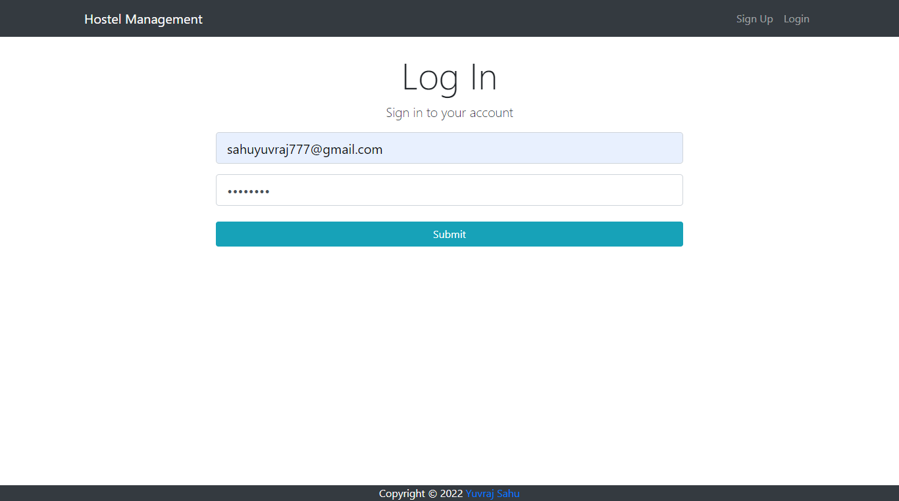
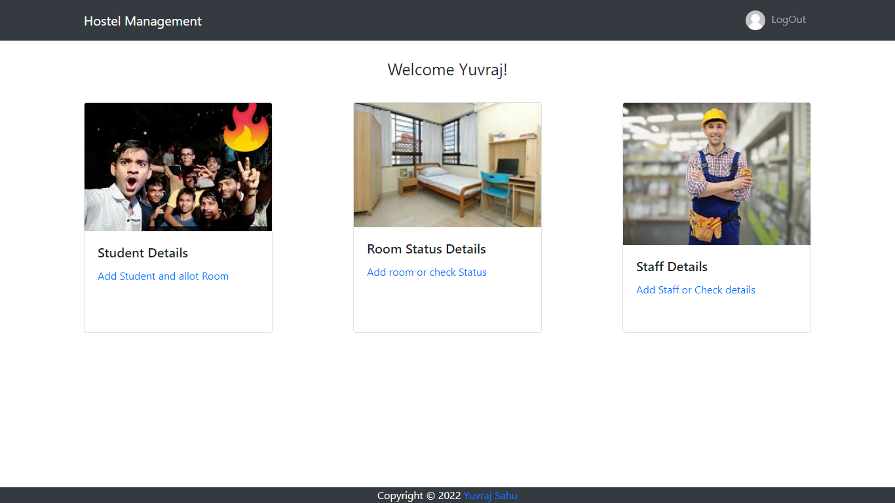
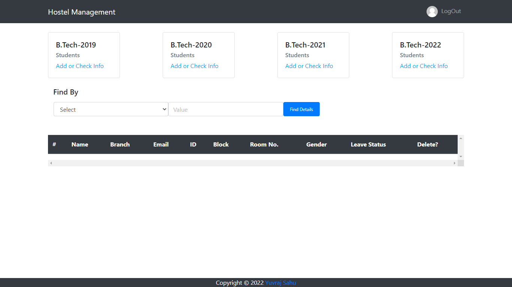
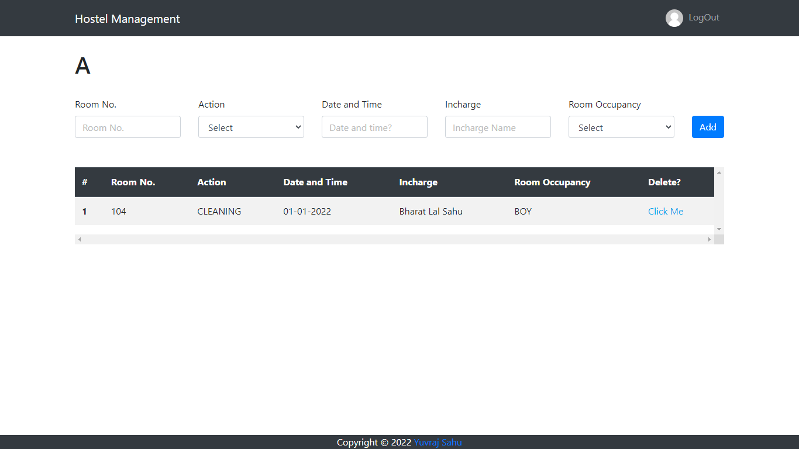

# Hostel Management

Manage Your Hostel

## 🔗 Website Links

https://hostel-management11.herokuapp.com/

## Development and Installation

### Install Backend Dependencies

- `npm install`

### Install Frontend Dependencies

- `npm run client-install`

### Setup up dev_keys for database

- Either run local MongoServer or,
- Setup Mongo Server at online platform like mlab and Create a keys_dev.js file in [config](https://github.com/sahuyuvraj/Hostel-Management/tree/master/config) folder and set up:-

```
module.exports = {
  mongoURI: YOUR_LOCAL_MONGO_SERVER_URI,
	secretOrKey: YOUR_SECRET
};
```

### Run the application

- `npm run dev`

### For testing

- `npm run test`

**Find API Documentation [here](https://github.com/sahuyuvraj/Hostel-Management/blob/master/API_Endpoints.md).**

### Screenshots








## Note

- You can set up the database on your local server of your college and create multiple ids to access that data. The Link mentioned in the Description https://hostel-management11.herokuapp.com/ has a common database instance created on [mlab](https://mlab.com/). It is just to show the working of the project in the deployed state. Feel free to test it out. But make sure to delete your entries after creating and testing it. Also, **don't save any personal information** over this deployed link because anyone can acces it. If amount of data exceeds the our storage at mlab, then it will be deleted.
- The application model is based on our [Institute](nitrr.ac.in) Hostel H. There are four blocks A, B, C, D. And four batches(B.Tech 2019, B.Tech 2020, B.Tech 2021, and B.Tech 2022) having occupancy in hostel rooms. These thing may differ for many Institute. You can change the structure of these components from [here](https://github.com/sahuyuvraj/Hostel-Management/tree/master/client/src/components/pages) according to your need.

Liked the project? Hit the star button to show support!

## Found an Issue or any suggestions

Make an issue [here](https://github.com/sahuyuvraj/Hostel-Management/issues/new).
